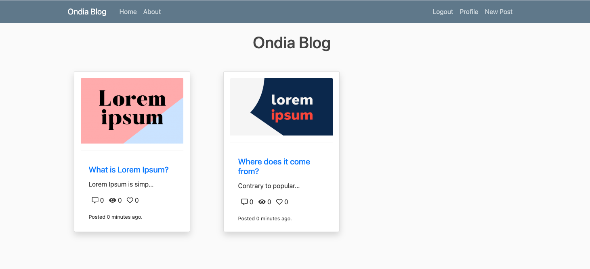

<p align="center">
  
</p>

# Emre Capstone Blog Project

Welcome to the **Emre Capstone Blog**, a full-stack Django application deployed on AWS infrastructure. This project enables users to publish blog posts enriched with images, videos, and comments — all supported by a cloud-native architecture.



---

## 🚀 Features

- ✍️ Users can create, update, and view blog posts  
- 💬 Comment system for each post  
- 📸 Image & video upload support (stored in S3)  
- 📊 View, like, and comment counters  
- 🔐 Secure credentials management with AWS SSM & `.env`  
- ☁️ Cloud deployment with AWS (EC2, RDS, S3, DynamoDB, Lambda)  
- 🛡️ Custom VPC deployment for high security  

---

## 🧱 Tech Stack

- **Backend:** Django 3.1.4  
- **Frontend:** Bootstrap 4, HTML5, CSS  
- **Database:** MySQL on AWS RDS  
- **Object Storage:** AWS S3  
- **Serverless:** AWS Lambda (with Python)  
- **Infra Tools:** AWS EC2, DynamoDB, SSM, VPC  
- **Dev Tools:** GitHub, autopep8, pycodestyle  

---

## 📁 Project Structure

```
src/
├── blog/                # Main blog app
├── users/               # User authentication
├── templates/           # HTML templates
├── static/              # CSS, JS, images
├── cblog/               # Settings and configuration
│   ├── settings.py
│   └── wsgi.py
├── lambda_function.py   # Lambda code for DynamoDB
├── requirements.txt     # Python packages
├── userdata.sh          # EC2 startup script
├── developer_notes.txt  # Developer notes
└── Guide.md             # Setup guide
```

---

## ⚙️ Setup Instructions

### 1. Clone the repository

```bash
git clone https://github.com/emrebiyik/emre-capstone-blog.git
cd emre-capstone-blog/src
```

### 2. Create and configure `.env` file

```env
SECRET_KEY=your-django-secret-key
DEBUG=False
```

Make sure you store AWS RDS password here instead of `settings.py`.

---

### 3. Install requirements

```bash
pip install -r requirements.txt
```

---

### 4. Configure AWS Services

- **S3:** Create a bucket and set `AWS_STORAGE_BUCKET_NAME` and `AWS_S3_REGION_NAME` in `settings.py`
- **RDS:** Create a MySQL DB, update:
  - `NAME`
  - `HOST`
  - `PORT`
- **Lambda + DynamoDB:** Use the `lambda_function.py` for creating a Lambda function to interact with DynamoDB.
- **VPC:** Deploy all services inside your secure custom VPC.

---

### 5. Run the application locally

```bash
python manage.py makemigrations
python manage.py migrate
python manage.py runserver
```

---

## 🧪 Failover Scenario Page

The app includes a simple static failover scenario page (`index.html`) with a placeholder image (`sorry.jpg`) for high availability and maintenance situations.

